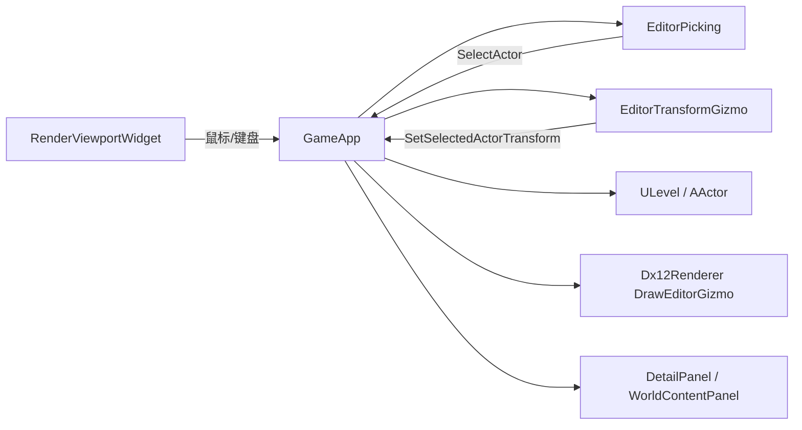

## 上下文

工程已具备 Qt 编辑器壳、`GameApp` 选中 API（`SelectActor` / `SetSelectedActorTransform`）、`DetailPanelWidget` Transform 编辑、`WorldContentPanelWidget` 大纲点选，以及 DX12 场景渲染与 **Line List** 调试绘制（网格/坐标轴）。视口 `RenderViewportWidget` 目前仅处理右键环视，**无左键拾取与 Gizmo**。

约束：

- 拾取/view 矩阵必须与 `Dx12Renderer::UpdateCameraConstants`（`LookToLH` + `PerspectiveFovLH`）一致，禁止 UI 层重复实现相机公式。
- Transform 单一数据源：`AActor::GetActorTransform` / `SetActorTransform`；Gizmo 与 Detail 均通过 `GameApp::SetSelectedActorTransform` 写入。
- 遵循项目 C++ 风格基线（UE 风格命名、Allman 大括号、tab 缩进）。
- 不引入新外部依赖；Gizmo 首版用线段 + 现有 Line PSO。

## 目标 / 非目标

**目标：**

- 视口左键拾取：在可见且未被视锥/距离裁剪的 Actor 中，选中射线参数 \(t\) 最小者。
- 在选中 Actor Root 世界位置绘制 Transform Gizmo，支持拖拽修改 Location / Rotation / Scale。
- `W` / `E` / `R` 切换 Gizmo 模式（UE5 对齐）。
- 视口、Gizmo、大纲、Detail 四处选中与 Transform 保持一致。
- 相机输入与 Gizmo 快捷键解耦（见决策 5）。

**非目标：**

- GPU / ID Buffer 拾取、遮挡感知拾取、多选、Pivot 切换、局部空间 Gizmo。
- Undo/Redo、吸附（Snap）、数值 Gizmo 输入框。
- 非 Transform 的 Detail 属性反射。

## 决策

### 决策 1：新增 `src/editor/` 模块，由 `GameApp` 编排

- **选择**：`EditorPicking`、`EditorTransformGizmo`（及共享类型 `EditorTypes.h`）独立于 `ui/` 与 `render/`，`GameApp` 持有并每帧驱动。
- **原因**：拾取与 Gizmo 是编辑器域逻辑，不应塞进 `Dx12Renderer` 或 Qt Widget。
- **备选**：全部写在 `GameApp.cpp` — 短期可行，很快难以维护。

### 决策 2：拾取采用 CPU 分层管线（Actor BVH → 三角 BVH Narrow Phase）

- **选择（MVP 后演进）**：
  1. 屏幕像素 → 世界射线（`EditorViewMatrices`，Y 翻转）。
  2. **Actor 级 BVH** broad phase：仅对射线相交的 Actor 做 detailed pick。
  3. 对每个可见 Primitive：OBB/Section 过滤后，**每 mesh 一次** `FEditorTriangleBvh::Query`（全索引 + `LocalMaxT` 剪枝）。
  4. Narrow phase：**Möller–Trumbore**（双面）；BVH 按 mesh 缓存，分割方式来自 `FEditorPerformanceSettings`。
- **原因**：大 StaticMesh 多 Section 时，per-section 全树 Query 会导致连点卡顿；三角面命中比 AABB 更符合视口点选预期。
- **备选**：仅 Ray-AABB（已废弃为最终命中）；Screen Fallback（已移除）。

### 决策 3：拾取/投影矩阵抽取共享函数

- **选择**：在 `editor/` 或 `math/` 提供 `BuildViewProjectionMatrix(Camera, ViewportSize, Near, Far)`，供 `EditorPicking` 与 `Dx12Renderer` 共用（或 Renderer 调用同一实现）。
- **原因**：矩阵不一致是拾取失效的首要风险。
- **备选**：复制 Renderer 代码 — 易漂移。

### 决策 4：Gizmo 渲染走 `Dx12Renderer` Line PSO 扩展接口

- **选择**：`Dx12Renderer::DrawEditorGizmo(const FGizmoLineBatch&)`，每帧上传动态线段 VB，场景 mesh 之后绘制；Gizmo 尺度按相机距离缩放（近似屏幕恒定大小）。
- **原因**：复用已验证的 line pipeline 与深度测试。
- **备选**：ImGui 覆盖层 — 与 3D 深度/遮挡不一致。

### 决策 5：输入优先级与 **BREAKING** 相机门控

- **选择**：
  1. 右键按住：仅环视（现有 `SetMouseLookActive`），`WASD`+`QE` 移动相机。
  2. 非环视：`W`/`E`/`R` **边沿触发**切换 Gizmo 模式，不移动相机。
  3. 左键：先测 Gizmo 命中 → 拖拽；否则拾取 Actor。
- **原因**：对齐 UE5；解决当前 `W`/`E` 同时用于移动与 Gizmo 的冲突（见 `GameApp::UpdateInput`）。
- **备选**：`Ctrl+W/E/R` — 无行为变更，但不符合 UE 习惯。

### 决策 6：交互状态与选中 API

- **选择**：保留 `GameApp::SelectActor` 为唯一选中写入点；新增 `EGizmoMode`、`PickActorAtViewportPosition`、`IsGizmoDragging()`；选中变化时 `BumpSceneRevision()`。
- **原因**：与现有大纲/Detail 刷新机制一致。

### 决策 7：Detail 同步策略

- **选择**：`DetailPanelWidget::RefreshFromSelection` 在 `SelectedActorId` 变化 **或** `GameApp::GetSceneRevision()` 变化且 Transform 脏时 `PopulateFromActorTransform`；`m_is_syncing_controls_` 防止 Gizmo → UI → Gizmo 回环。
- **原因**：仅比较 ActorId 无法反映 Gizmo 拖拽中的数值变化。

### 决策 8：Gizmo 锚点与 Transform 写入

- **选择**：锚点 = `RootComponent::GetWorldLocation()`，无 Root 时用 `ActorTransform.Position`；**拖拽中**直接 `AActor::SetActorTransform`，由 `Tick` 单路径渲染；**Detail 提交**走 `SetSelectedActorTransform(..., bBumpSceneRevision=true)`；**拖拽结束**再 `BumpSceneRevision()`。
- **原因**：满足「Root 世界坐标」；避免 `RefreshActiveLevelRender` 导致每帧双次 Present（VSync 下约 30 FPS）。

### 决策 9：编辑器性能设置（三角 BVH）

- **选择**：`编辑 → 性能` 对话框 + `Config/EditorPerformance.ini`；`TriangleBvhSplitMethod` 为 Median（默认）或 SAH；变更时 `InvalidateTriangleBvhCache()`。
- **原因**：大网格拾取建树成本高，允许在质量/构建时间间权衡。

### 决策 10：拾取与 Gizmo 的性能约束（实现约束）

- **选择**：禁止在热路径调用 `RefreshActiveLevelRender`；`SetSelectedActorTransform` 不触发即时 Present；Gizmo 拖拽无 Transform delta 时不写回。
- **原因**：运行时日志证实双 Present 与无意义 `BumpSceneRevision` 是卡顿主因，而非 intentional 30 FPS  cap。

## 模块与数据流



**`GameApp::Tick` 建议顺序**：

1. `ValidateSelectedActor`
2. 处理 `W/E/R` 边沿（非环视）
3. `UpdateInput`（相机，仅环视时 WASD+QE）
4. `TickEditorInteraction`（Gizmo 悬停/拖拽）
5. 渲染（场景 + Gizmo）
6. UI `RefreshScenePanels`（帧末，已有）

## 文件布局（实现参考）

```text
OpenSpecTest/src/editor/
  EditorTypes.h              // EGizmoMode, EPickTriangleBvhSplitMethod, ...
  EditorPicking.h/.cpp
  EditorTriangleBvh.h/.cpp
  EditorPickBvh.h/.cpp
  EditorTransformGizmo.h/.cpp
  EditorViewMatrices.h/.cpp
  EditorPerformanceSettings.h
OpenSpecTest/src/data/
  EditorPerformanceStore.h/.cpp
OpenSpecTest/src/ui/
  EditorPerformanceDialog.h/.cpp
```

触点：`GameApp`、`MainWindow.cpp`（`RenderViewportWidget`）、`DetailPanelWidget`、`Dx12Renderer`。

## 风险 / 权衡

| 风险 | 缓解 |
|------|------|
| 拾取矩阵与渲染不一致 | 共享 `BuildViewProjection`；单测对比投影结果 |
| 无 mesh 的 Actor 无法选中 | 默认世界空间小球 AABB（半径 ~0.5m） |
| Gizmo 轴过细难点中 | 屏幕恒定尺度 + 放大命中容差（像素阈值） |
| 相机行为 BREAKING 影响习惯 | 提案与发布说明中标注；环视仍用右键+WASD |
| 每帧重建 Gizmo VB 开销 | MVP 可接受；线段数 < 100；后续可复用 ring 缓存 |
| `DetailPanel` 刷新过频 | 拖拽时节流或仅 revision 变化时 Populate |

## Migration Plan

1. **P1**：`EditorPicking` + 视口左键 + `SelectActor` + 大纲/Detail 联动（无 Gizmo）。
2. **P2**：视锥/`CullDistance` 过滤。
3. **P3**：`EditorTransformGizmo` 绘制 + `W/E/R` + 相机门控调整。
4. **P4**：Gizmo 拖拽 + Detail 实时同步 + `DrawEditorGizmo`。
5. **P5**：验收（空白取消、最近选中、三模式、超载/断选清理）。

回滚：通过编译开关或 `GameApp` 布尔禁用 `TickEditorInteraction` 与拾取，恢复旧相机 `W/E` 行为。

## Open Questions

- `BuildViewProjection` 放在 `editor/` 还是抽到 `math/` 供 Renderer 反向依赖？
- 旋转 Gizmo 是否首版仅支持单轴环，还是同时支持视图平面环？
- 大纲「选中高亮」是否在本变更必须完成，还是可随 `WorldContentPanel` 小改一并交付？
